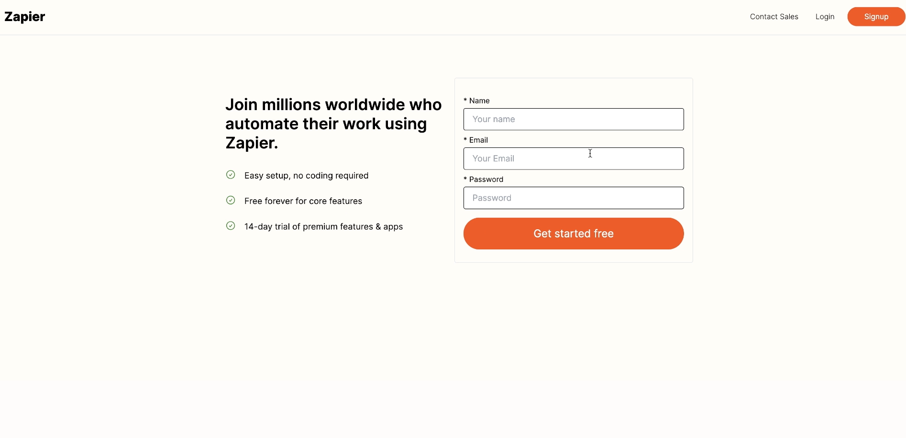
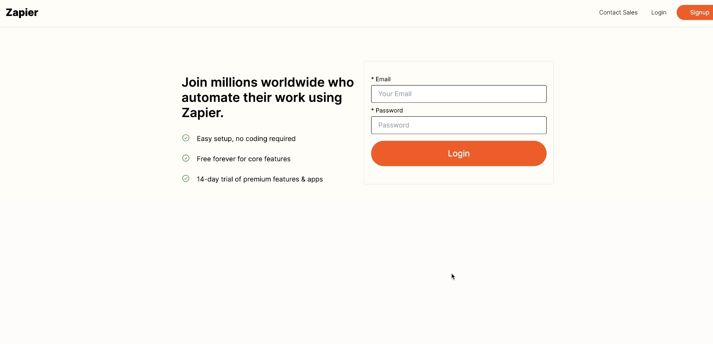
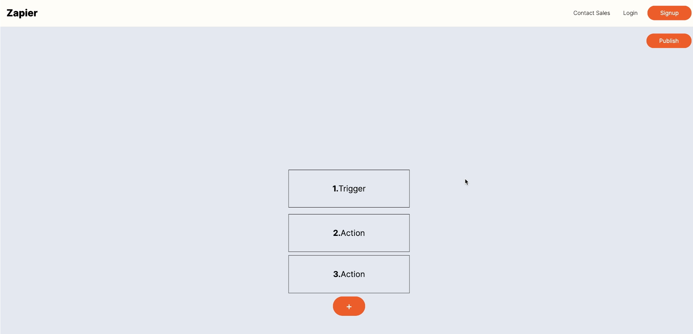
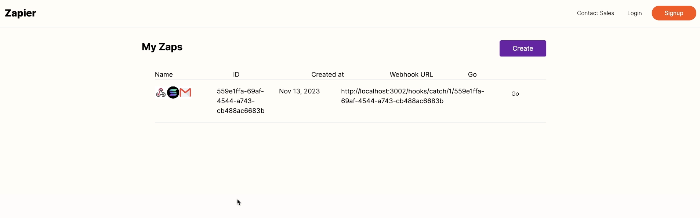

# Zapier-like Application

Welcome to the Zapier-like application! This project demonstrates a web application built with a combination of frontend and backend technologies, designed to mimic the functionality of Zapier.


## Project Screenshots

Here are some screenshots of the project:







## Project Structure

The project is divided into multiple components:

- **Frontend**: A Next.js application for the user interface.
- **Hooks**: Contains custom hooks and utilities.
- **Primary Backend**: The main backend service handling API requests.
- **Processor**: A service for processing data with Kafka.
- **Worker**: A worker service for additional tasks like sending emails and interacting with Solana blockchain.

## Technologies Used

- **Frontend**: 
  - [Next.js](https://nextjs.org/)
  - [React](https://reactjs.org/)
  - [Tailwind CSS](https://tailwindcss.com/)

- **Backend**: 
  - [Express.js](https://expressjs.com/)
  - [Prisma](https://www.prisma.io/)
  - [KafkaJS](https://kafka.js.org/)
  - [Solana Web3](https://solana.com/)
  - [Nodemailer](https://nodemailer.com/)

## Setup and Installation

### Frontend

1. Navigate to the `frontend` directory:
   ```bash
   cd frontend
